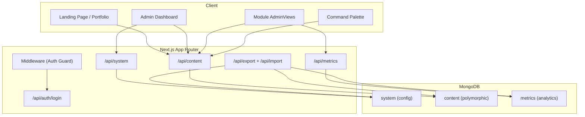

# 🧠 Life OS

A high-fidelity, open-source template framework that acts as a **"Shell"** — dynamically rendering a professional portfolio and a private life-management dashboard.

Built with **Next.js 16**, **Tailwind CSS v4**, **MongoDB**, and **Framer Motion**.

[](https://app.netlify.com/start/deploy?repository=https://github.com/your-username/LifeOS#MONGODB_URI=&ADMIN_PASSWORD=&JWT_SECRET=)

---

## ✨ Features

- **18 Built-in Modules** — Portfolio, Blog, Expenses, Subscriptions, Reading Queue, Bookshelf, Ideas, Snippets, Habits, Analytics, Compass, Crop History, EMI Tracker, Calculators, Rain Tracker, Shopping List, AI Usage, Todo
- **Modular Architecture** — Add or remove "micro-app" modules without affecting the core shell
- **Polymorphic Data Layer** — All module data in a single MongoDB collection, validated by Zod
- **JWT Authentication** — Password-based admin login with HTTP-only cookies
- **Dynamic Routing** — `app/admin/[module]` catch-all renders any registered module's AdminView
- **7 Developer Themes** — One Dark, Dracula, Cyberpunk, Studio Dark, Nordic Light, Midnight One, Vampire
- **Command Palette** — `Ctrl+K` global search and quick actions
- **Data Portability** — Full JSON export/import for backup and migration
- **Self-Hosted Analytics** — Page views, device types, referrers — no third-party scripts
- **GitHub-Style Habit Heatmap** — Track streaks with a contribution grid

## 📦 Tech Stack

| Layer | Technology |
|-------|-----------|
| Framework | Next.js 16 (App Router, Turbopack) |
| Styling | Tailwind CSS v4, Framer Motion |
| Database | MongoDB Atlas |
| Validation | Zod v4 |
| Auth | jose (edge-compatible JWT) |
| Package Manager | pnpm |

---

## 🧩 Module Suite

| Module | Type | Description |
|--------|------|-------------|
| **Portfolio** | Public | Hero, bio, skills, social links, "Available for hire" badge |
| **Blog** | Public | Markdown editor, dual-pane preview, draft/publish/archive, SEO |
| **Expenses** | Private | Daily spending ledger, category tags, smart suggestions |
| **Subscriptions** | Private | Recurring costs, renewal countdowns, monthly burn |
| **Reading Queue** | Private | URL-based queue, priority levels, type filters, read/unread |
| **Bookshelf** | Private | Progress bars, star ratings, status tracking, notes |
| **Idea Dump** | Private | Kanban-style board, promote to portfolio, 5 status stages |
| **Snippet Box** | Private | Code library, one-click copy, syntax preview, favorites |
| **Habit Tracker** | Private | Heatmap calendar, streak counters, color-coded, daily logging |
| **Analytics** | Private | Sparkline charts, device breakdown, top pages, referrers |
| **Compass** | Private | Task prioritization, P1-P5 levels, workspace organization |
| **Crop History** | Private | Agricultural tracking, formulas, area-based analytics |
| **EMI Tracker** | Private | Loan management, cost distribution, payment schedules |
| **Calculators** | Private | Custom math tools, recurring calculations |
| **Rain Tracker** | Private | Precipitation logging, area-wise distribution |
| **Shopping List** | Private | Inventory management, category filters |
| **AI Usage** | Private | Tracking token counts and AI costs |
| **Todo** | Private | Task management with custom UI |

---

## 🏗️ Architecture



---

## 🚀 Quick Start (Local Development)

### Prerequisites

- **Node.js** ≥ 18
- **pnpm** — Install via `npm install -g pnpm`
- **MongoDB Atlas** free cluster ([create one here](https://www.mongodb.com/cloud/atlas/register))

### 1. Clone the repository

```bash
git clone https://github.com/your-username/LifeOS.git
cd LifeOS
```

### 2. Install dependencies

```bash
pnpm install
```

### 3. Set up environment variables

```bash
cp .env.local.example .env.local
```

Edit `.env.local`:

```env
MONGODB_URI=mongodb+srv://<username>:<password>@cluster0.xxxxx.mongodb.net/lifeos?retryWrites=true&w=majority
ADMIN_PASSWORD=YourSecurePassword123
JWT_SECRET=some-long-random-secret-string
```

### 4. Run the development server

```bash
pnpm dev
```

Open [http://localhost:3000](http://localhost:3000) — your Portfolio will be the first thing visitors see.

### 5. Access the Admin Portal

1. Navigate to [http://localhost:3000/login](http://localhost:3000/login)
2. Enter your `ADMIN_PASSWORD`
3. You'll be redirected to the **Command Center** at `/admin`

> On first run, the database is automatically seeded with default system configuration.

---

## ☁️ Deploy to Netlify

1. Click the **Deploy to Netlify** button above (or fork + connect manually)
2. Set the 3 environment variables: `MONGODB_URI`, `ADMIN_PASSWORD`, `JWT_SECRET`
3. Deploy — the app will auto-seed on first visit
4. Login at `/login` with your password

---

## 📁 Project Structure

```
src/
├── app/                          # Next.js App Router
│   ├── page.tsx                  # Public portfolio landing page
│   ├── admin/
│   │   ├── page.tsx              # Dashboard (10-widget Bento grid)
│   │   ├── settings/page.tsx     # Themes, visibility, export/import
│   │   └── [module]/page.tsx     # Dynamic module routing
│   └── api/
│       ├── auth/login/           # POST: password → JWT cookie
│       ├── content/              # GET/POST: polymorphic CRUD
│       ├── content/[id]/         # GET/PUT/DELETE: single item
│       ├── system/               # GET/PUT: global config
│       ├── metrics/              # GET/POST: analytics events
│       ├── export/               # GET: backup download
│       └── import/               # POST: restore from backup
├── lib/
│   ├── mongodb.ts                # Cached MongoClient singleton
│   ├── auth.ts                   # JWT sign/verify (jose)
│   ├── schemas.ts                # 9 Zod schemas + SchemaRegistry
│   ├── seed.ts                   # First-run DB initializer
│   └── utils.ts                  # cn() utility
├── modules/                      # 18 self-contained modules
│   ├── portfolio/                # AdminView + Widget + View
│   ├── blog/                     # AdminView + Widget
│   ├── expenses/                 # AdminView + Widget
│   ├── subscriptions/            # AdminView + Widget
│   ├── reading/                  # AdminView + Widget
│   ├── bookshelf/                # AdminView + Widget
│   ├── ideas/                    # AdminView + Widget
│   ├── snippets/                 # AdminView + Widget
│   ├── habits/                   # AdminView + Widget
│   ├── analytics/                # AdminView + Widget
│   ├── compass/                  # AdminView + Widget
│   ├── crop-history/             # AdminView + Widget
│   ├── emi-tracker/              # AdminView + Widget
│   ├── calculators/              # AdminView + Widget
│   ├── rain-tracker/             # AdminView + Widget
│   ├── shopping-list/            # AdminView + Widget
│   ├── ai-usage/                 # AdminView + Widget
│   └── todo/                     # AdminView + Widget
├── components/shell/             # Sidebar, Header, Footer
├── registry.ts                   # Module slug → config mapping
└── proxy.ts                      # Auth guard middleware
```

---

## 🔌 Adding a New Module

1. Create `src/modules/your-module/AdminView.tsx`
2. Add a Zod schema to `src/lib/schemas.ts` and register it in `SchemaRegistry`
3. Register the module in `src/registry.ts`:
   ```ts
   your_module: { name: "Your Module", icon: "Star", defaultPublic: false }
   ```
4. Add the icon to `IconMap` in `AdminSidebar.tsx`
5. Add the widget import to `src/app/admin/page.tsx`

Data automatically saves to the `content` collection under `module_type: "your_module"` — **zero database setup**.

See [CONTRIBUTING.md](./CONTRIBUTING.md) for detailed conventions.

---

## 🛠️ Available Scripts

| Command | Description |
|---------|-------------|
| `pnpm dev` | Start development server (Turbopack) |
| `pnpm build` | Create production build |
| `pnpm start` | Run production server |
| `pnpm lint` | Run ESLint |

---

## 📄 License

This project is licensed under the terms in the [LICENSE](./LICENSE) file.
