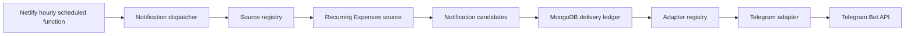

# LifeOS Notification Platform Design

**Date:** 2026-07-30

**Status:** Approved design; ready for implementation planning

**Initial adapter:** Telegram

**Initial notification source:** Recurring Expenses

**Primary configuration route:** `/admin/settings?tab=notifications`

## Overview

LifeOS needs a shared notification platform that lets independently developed
modules schedule messages without depending on a particular delivery provider.
The first release connects Telegram and turns the existing Recurring Expenses
“Notify of renewal” option into a real external notification.

The platform has two extension boundaries:

1. **Notification sources** translate module data into provider-neutral
   notification candidates.
2. **Notification adapters** translate provider-neutral messages into calls to
   Telegram, Slack, WhatsApp, or another provider.

A central dispatcher discovers candidates, records idempotent delivery work,
claims it safely, invokes adapters, and records outcomes. An hourly Netlify
Scheduled Function invokes the dispatcher. System Settings owns global delivery
configuration and adapter connections; modules own their event semantics and
per-item rules.

## Goals

- Configure Telegram from a new Notifications tab in System Settings.
- Encrypt Telegram bot tokens at rest and never return them to the browser.
- Send recurring-expense renewal notifications on one or more selected lead
  days.
- Make existing records with `enable_reminders: true` participate
  automatically using a one-day default after notifications are enabled.
- Prevent normal duplicate delivery across repeated, concurrent, or retried
  scheduler runs.
- Retain recent delivery history for operational visibility.
- Give future adapters and modules small, explicit registration contracts.
- Keep notification behavior disabled by default during rollout.
- Preserve compatibility with existing recurring-expense data and old
  application versions.

## Non-Goals

- Receiving Telegram commands or processing Telegram webhooks.
- A general-purpose message-template editor.
- Per-user notification preferences or multi-tenant isolation.
- Push notifications, email, SMS, WhatsApp, or Slack implementation in this
  release.
- Guaranteed exactly-once delivery after an ambiguous external network
  failure.
- A standalone queue service.
- Editing notification history.
- Exporting adapter credentials in LifeOS JSON backups.

## Architectural Decision

Use a **registry-based notification platform with scheduled discovery and a
MongoDB delivery ledger**.



### Why this approach

- Module code never calls Telegram directly.
- Adapter code never interprets recurring-expense dates.
- Candidate discovery recovers naturally after an outage without requiring an
  event queue.
- The delivery ledger makes retries and duplicate prevention observable.
- The design matches the current personal-scale MongoDB and Netlify
  architecture.

### Rejected alternatives

#### Telegram-specific cron

A Telegram-specific route could scan recurring expenses and send messages with
less initial code. It would couple the first module to the first provider and
force later modules to duplicate scheduling, retry, security, and audit logic.

#### Full event queue

Materializing jobs on every content mutation would provide stronger large-scale
queue semantics. It would also require change-event synchronization, missed
event recovery, and additional infrastructure that LifeOS does not currently
need. Scheduled source discovery is simpler and self-healing.

## Terminology

| Term           | Meaning                                                         |
| -------------- | --------------------------------------------------------------- |
| Adapter        | Code implementation for a provider such as Telegram.            |
| Channel        | One persisted adapter connection and destination.               |
| Source         | A module implementation that discovers notification candidates. |
| Candidate      | Provider-neutral event that may need delivery.                  |
| Delivery       | One candidate expanded to one channel.                          |
| Rule           | An item-level event and its lead-day offsets.                   |
| Event date     | The module-owned calendar date, such as a renewal date.         |
| Scheduled date | Event date minus a configured lead-day offset.                  |

## Shared Contracts

The browser-safe contracts live separately from server-only registries,
credentials, and dispatcher code.

### Adapter types

```ts
export type NotificationAdapterType = "telegram";
```

This union expands when a provider is implemented. Unimplemented providers do
not appear as selectable values.

### Item preferences

```ts
export interface NotificationPreferences {
  enabled: boolean;
  rules: NotificationRule[];
}

export interface NotificationRule {
  event: string;
  offsets_days: number[];
  channel_ids?: string[];
}
```

Rules use these invariants:

- `event` is a lowercase identifier containing letters, digits, underscores,
  or hyphens.
- `offsets_days` contains one to ten unique integers from `0` through `365`.
- `0` means the event date.
- Missing `channel_ids` means all enabled channels.
- If `channel_ids` is supplied, every value must be a valid MongoDB ObjectId
  string and at least one ID must be present.
- `rules` contains at most ten entries, and each `event` appears at most once.
- An enabled preference must contain at least one rule.

The initial recurring-expense representation is:

```json
{
  "notifications": {
    "enabled": true,
    "rules": [
      {
        "event": "renewal",
        "offsets_days": [1, 2, 7]
      }
    ]
  }
}
```

### Provider-neutral message

```ts
export interface NotificationMessage {
  title: string;
  body: string;
  url?: string;
}
```

Limits:

- `title`: 1–200 characters.
- `body`: 1–3000 characters.
- `url`: optional valid HTTP or HTTPS URL, at most 2048 characters.

The Telegram adapter sends plain text in v1. It does not enable a parse mode,
which prevents module-provided text from becoming Telegram markup.

### Candidate

```ts
export interface NotificationCandidate {
  source: {
    module_type: string;
    document_id: string;
    event: string;
    event_date: string;
  };
  scheduled_date: string;
  offset_days: number;
  channel_ids?: string[];
  message: NotificationMessage;
}
```

`event_date` and `scheduled_date` are strict `YYYY-MM-DD` calendar keys.

### Source contract

```ts
export interface NotificationSourceContext {
  db: Db;
  now: Date;
  systemConfig: SystemConfig;
  settings: NotificationSettings;
}

export interface NotificationSourceActivationSummary {
  module_type: string;
  label: string;
  eligible_count: number;
  explicit_count: number;
  legacy_count: number;
}

export interface NotificationSourceCollectionResult {
  candidates: NotificationCandidate[];
  items_skipped: number;
}

export interface NotificationSource {
  readonly moduleType: string;
  collectCandidates(
    context: NotificationSourceContext,
  ): Promise<NotificationSourceCollectionResult>;
  getActivationSummary(
    context: NotificationSourceContext,
  ): Promise<NotificationSourceActivationSummary>;
}
```

Every registered source implements candidate collection and a safe activation
summary for the Settings preview.

### Adapter contract

```ts
export interface AdapterTestResult {
  provider_account_label: string;
  destination_label: string;
}

export interface AdapterSendResult {
  external_message_id?: string;
}

export interface NotificationAdapter<RuntimeConfig = unknown> {
  readonly type: NotificationAdapterType;
  test(config: RuntimeConfig): Promise<AdapterTestResult>;
  send(
    config: RuntimeConfig,
    message: NotificationMessage,
  ): Promise<AdapterSendResult>;
}
```

The adapter registry returns an implementation by `adapter_type` and throws a
typed unsupported-adapter error for unknown values.

## Global Settings

Store non-secret runtime settings under `system.notificationSettings`.

```ts
export interface NotificationSettings {
  enabled: boolean;
  timezone: string;
  deliveryHour: number;
  catchUpHours: number;
}
```

Defaults:

```ts
export const DEFAULT_NOTIFICATION_SETTINGS: NotificationSettings = {
  enabled: false,
  timezone: "UTC",
  deliveryHour: 9,
  catchUpHours: 36,
};
```

Rules:

- `timezone` must be an IANA timezone supported by the running JavaScript
  runtime.
- The browser proposes its `Intl.DateTimeFormat().resolvedOptions().timeZone`
  during first-time setup.
- The server falls back to `UTC` until a valid timezone is saved.
- `deliveryHour` is an integer from `0` through `23`.
- `catchUpHours` is fixed at `36` in v1 and is not user-editable.
- Global `enabled` defaults to `false`.

Recurring-expense defaults stay with the existing
`recurringExpenseSettings` object:

```ts
defaultNotificationOffsetsDays: number[]; // defaults to [1]
```

This keeps module policy out of global provider configuration.

## Persistent Data

### `notification_channels`

```ts
export interface EncryptedCredential {
  version: 1;
  algorithm: "aes-256-gcm";
  iv: string;
  auth_tag: string;
  ciphertext: string;
}

export interface TelegramChannelConfig {
  chat_id: string;
  bot_username: string;
  destination_label: string;
}

export interface NotificationChannelDocument {
  _id?: ObjectId;
  adapter_type: "telegram";
  name: string;
  enabled: boolean;
  config: TelegramChannelConfig;
  credentials: EncryptedCredential;
  last_tested_at: string;
  last_test_status: "success" | "failed";
  last_error?: string;
  created_at: string;
  updated_at: string;
}
```

The safe API DTO omits `credentials` and the full destination identifier:

```ts
export interface NotificationChannelDto {
  id: string;
  adapter_type: "telegram";
  name: string;
  enabled: boolean;
  config: {
    bot_username: string;
    destination_label: string;
    chat_id_hint: string;
  };
  has_credentials: true;
  last_tested_at: string;
  last_test_status: "success" | "failed";
  last_error?: string;
  created_at: string;
  updated_at: string;
}
```

`chat_id_hint` contains only the final four characters prefixed by `****`.

Indexes:

- `{ adapter_type: 1, created_at: -1 }`
- `{ enabled: 1, adapter_type: 1 }`

Multiple Telegram channels are valid. By default, a notification is delivered
to every enabled channel.

### `notification_deliveries`

```ts
export type NotificationDeliveryStatus =
  | "pending"
  | "processing"
  | "sent"
  | "failed"
  | "dead_letter";

export interface NotificationDeliveryDocument {
  _id?: ObjectId;
  dedupe_key: string;
  channel_id: ObjectId;
  channel_snapshot: {
    name: string;
    adapter_type: NotificationAdapterType;
  };
  source: NotificationCandidate["source"];
  scheduled_date: string;
  offset_days: number;
  message_snapshot: NotificationMessage;
  status: NotificationDeliveryStatus;
  attempt_count: number;
  next_attempt_at?: string;
  lease_expires_at?: string;
  external_message_id?: string;
  sent_at?: string;
  last_error?: {
    code: string;
    message: string;
    retryable: boolean;
  };
  created_at: string;
  updated_at: string;
  expire_at: Date;
}
```

Indexes:

- Unique `{ dedupe_key: 1 }`
- `{ status: 1, next_attempt_at: 1 }`
- `{ channel_id: 1, created_at: -1 }`
- TTL `{ expire_at: 1 }` with `expireAfterSeconds: 0`

`expire_at` is set to 90 days after creation.

Deleting a channel does not delete delivery history. `channel_snapshot`
preserves enough information for the activity UI.

If a channel is disabled or deleted after a delivery is materialized but
before it is sent, the dispatcher marks that delivery `dead_letter` with
`channel_disabled` or `channel_not_found`. Re-enabling a channel does not send
those stale records.

## Credential Security

### Encryption key

Add a required runtime variable for connected channels:

```text
NOTIFICATION_ENCRYPTION_KEY
```

It is a base64-encoded 32-byte random key. Generate it with:

```bash
openssl rand -base64 32
```

The key is read only on the server. It is not prefixed with `NEXT_PUBLIC_`.
Missing or malformed configuration produces a typed configuration error.

The application can still render the Notifications tab when the key is
missing. The overview reports `encryption_ready: false`; creating, updating,
testing, or dispatching a channel returns an actionable safe error.

### Encryption envelope

- AES-256-GCM.
- Random 12-byte IV for every encryption.
- Store ciphertext, IV, and authentication tag as base64.
- Authenticate before returning plaintext.
- Reject unsupported envelope versions and algorithms.
- Never use `JWT_SECRET` as the credential encryption key.
- Never log the bot token, encrypted envelope, or a Telegram URL containing
  the token.

### Backup behavior

LifeOS JSON backup currently exports `system`, `content`, and `metrics`. The
new credential and delivery collections remain excluded:

- `notification_channels` is excluded to prevent downloaded backups from
  containing provider credentials.
- `notification_deliveries` is excluded because it is temporary operational
  history.
- `system.notificationSettings` and item preferences remain in the backup.

After a restore, notifications safely remain ineffective until a channel is
connected. No item stores a channel reference in the initial UI, so reconnecting
does not require rewriting recurring expenses.

## Telegram Adapter

### Runtime configuration

```ts
export interface TelegramRuntimeConfig {
  botToken: string;
  chatId: string;
}
```

### Connection test

The test performs these operations:

1. Call `getMe` to validate the token and obtain the bot username.
2. Call `sendMessage` to the configured chat with a short LifeOS test message.
3. Return the bot username and a safe destination label.

The initial connection is persisted only after both operations succeed.

The user must first start the bot in a private chat, add it to a group, or add
it to a channel with suitable permissions. Telegram bots cannot initiate a
private conversation with a user who has never contacted the bot.

### Sending

- Use the official HTTPS Bot API.
- Send JSON with `chat_id` and plain `text`.
- Use an abort timeout of 10 seconds.
- Do not enable paid broadcast options.
- Do not include the token in error strings.
- Parse the Telegram `ok`, `description`, `error_code`, and retry metadata into
  typed adapter errors.
- Return Telegram’s message ID as `external_message_id` when available.

### Retry classification

| Failure                      | Classification                               |
| ---------------------------- | -------------------------------------------- |
| Network failure or timeout   | Retryable                                    |
| Telegram `429`               | Retryable; honor a bounded retry delay       |
| Telegram `5xx`               | Retryable                                    |
| Invalid token                | Permanent                                    |
| Invalid or inaccessible chat | Permanent                                    |
| Other stable Telegram `4xx`  | Permanent                                    |
| Malformed Telegram response  | Retryable once, then bounded by max attempts |

## Recurring Expenses Integration

### Schema

Extend `RecurringExpenseSchema` with:

```ts
notifications: NotificationPreferencesSchema.optional();
```

Keep:

```ts
enable_reminders: z.boolean().default(true);
```

The legacy field is not removed in this release.

### Compatibility resolver

Use one resolver everywhere notification behavior is interpreted:

```ts
resolveRecurringExpenseNotificationPreferences(
  payload,
  defaultOffsetsDays,
): NotificationPreferences
```

Behavior:

1. If valid `payload.notifications` exists, use it.
2. Otherwise set `enabled` from `payload.enable_reminders !== false`.
3. Create one `renewal` rule using the module default offsets.
4. If the module default is unavailable or invalid, use `[1]`.

New and edited records write:

- `enable_reminders` equal to `notifications.enabled`.
- The complete `notifications` object.

This preserves older code while making the nested object authoritative for new
code.

### Date semantics

Recurring-expense renewal dates are entered as calendar dates and currently
stored as ISO datetimes. Notification scheduling must use:

```ts
payload.next_renewal_date.slice(0, 10);
```

as the event-date key. It must not reinterpret the renewal through the server’s
local timezone.

For each offset:

```text
scheduled date = renewal calendar date - offset days
```

The dispatcher resolves each scheduled calendar date at
`notificationSettings.deliveryHour` in `notificationSettings.timezone` to a
UTC instant. The conversion uses these daylight-saving disambiguation rules:

- If the local hour occurs twice, use the earlier occurrence.
- If the local hour does not exist, use the first valid local instant after the
  gap.

A candidate is due when its resolved scheduled instant is no later than `now`
and is not more than `catchUpHours` before `now`.

Calendar arithmetic must not assume that every local day is 24 hours.

### Candidate query

The source reads only:

- `module_type: "recurring_expense"`
- Active records.
- Renewal dates capable of producing a scheduled date inside the catch-up
  window or the supported 365-day lookahead.

It validates and normalizes every record before emitting candidates. One
malformed record increments a skip count and does not fail the whole source.

### Message format

Example:

```text
Netflix renews tomorrow
₹649 · Monthly · 31 Jul 2026
Streaming
```

Wording:

- Offset `0`: “renews today”
- Offset `1`: “renews tomorrow”
- Offset greater than `1`: “renews in N days”

The title includes the expense name and relative date. The body includes cost,
billing cycle, formatted renewal date, and category. If the expense has a valid
URL, the candidate may include it.

### Renewal lifecycle

The existing Renew action advances `next_renewal_date`. Because the event date
is part of the deduplication identity, the next billing cycle creates new
deliveries without removing prior history.

Disabling the item, disabling its notification preference, or deleting it
prevents future candidate discovery. Already sent history remains.

## Deduplication and Claiming

### Deduplication key

Build the key from canonical strings:

```text
module_type
+ document_id
+ event
+ event_date
+ offset_days
+ channel_id
```

Hash the canonical value with SHA-256 before storage.

The message body is not part of the key. Editing copy after a delivery does not
resend the same event and offset.

### Delivery materialization

For every candidate-channel pair, upsert a pending delivery using
`$setOnInsert`. A duplicate-key race is treated as “already materialized,” not
as a run failure.

### Atomic claim

Workers claim one eligible delivery with `findOneAndUpdate`:

- `pending`; or
- `failed` with `next_attempt_at <= now`; or
- `processing` with an expired lease.

The update:

- Sets `status: "processing"`.
- Sets a lease five minutes into the future.
- Increments `attempt_count`.
- Updates `updated_at`.

Only the worker that receives the claimed document sends it.

### Completion

On success:

- Set `status: "sent"`.
- Store `sent_at` and optional `external_message_id`.
- Remove lease and retry fields.

On retryable failure with fewer than three attempts:

- Set `status: "failed"`.
- After attempt one, set `next_attempt_at` to at least five minutes later.
- After attempt two, set `next_attempt_at` to at least thirty minutes later.
- When Telegram supplies `retry_after`, use the larger delay, capped at six
  hours.
- Store a sanitized error.
- Remove the lease.

On a permanent failure or the third failed attempt:

- Set `status: "dead_letter"`.
- Store a sanitized error.
- Remove the lease.

## Delivery Guarantee

The system prevents ordinary duplicate sends caused by:

- Repeated hourly discovery.
- Concurrent function invocations.
- Deploy retries.
- Stale processing leases.
- Manual dispatch overlapping with the scheduled run.

External delivery is **at least once**, not exactly once. If Telegram accepts a
message but the HTTP response is lost, the system cannot prove acceptance and
may retry. Telegram’s `sendMessage` API does not expose an application-defined
idempotency key.

## Dispatcher

The shared entry point is:

```ts
runNotificationDispatch({
  now?: Date;
  batchSize?: number;
}): Promise<NotificationDispatchSummary>
```

Summary:

```ts
export interface NotificationDispatchSummary {
  sources_scanned: number;
  candidates_discovered: number;
  deliveries_created: number;
  deliveries_deduplicated: number;
  deliveries_sent: number;
  deliveries_failed: number;
  deliveries_dead_lettered: number;
  items_skipped: number;
}
```

Run order:

1. Load and validate global settings.
2. Return a zero summary when globally disabled.
3. Load enabled channels.
4. Return a zero summary when none exists.
5. Ask each registered source for candidates.
6. Isolate source failures so one source does not stop other sources.
7. Add each source result’s `items_skipped` to the run summary.
8. Resolve a candidate’s channels.
9. Expand candidate-channel pairs and materialize them with unordered MongoDB
   bulk upserts.
10. Claim and process at most the configured batch size.
11. Process sends with concurrency capped at five.
12. Isolate channel and delivery failures.
13. Return and log the safe summary.

The production batch size is `10`; accepted overrides are clamped from `1`
through `10`. With a 10-second adapter timeout and concurrency of five, at most
two send waves run during one invocation. A later hourly invocation continues
pending work.

## Scheduling

Create a Netlify Scheduled Function that imports and calls
`runNotificationDispatch`.

Use:

```toml
[functions."notifications-dispatch"]
  schedule = "@hourly"
```

The function is a thin transport entry point:

- No domain logic.
- No public HTTP cron endpoint.
- No cookie or CSRF bypass.
- Logs only the safe dispatch summary or a sanitized top-level error.

Netlify schedules run in UTC and only on published deployments. The dispatcher
therefore enforces the configured IANA timezone and local delivery hour.
Netlify scheduled functions currently have a 30-second limit, which is why
delivery processing is bounded.

Local verification uses `netlify functions:invoke notifications-dispatch`.
Netlify Dev does not execute scheduled functions automatically.

Reference:
[Netlify Scheduled Functions](https://docs.netlify.com/build/functions/scheduled-functions/)

## API Surface

All routes are protected by `src/proxy.ts` and repeat the admin-token check in
the handler for defense in depth.

### `GET /api/notifications/overview`

Returns:

- Merged runtime settings.
- `encryption_ready`.
- Safe channel DTOs.
- Per-source activation summaries.
- Counts of recent sent, failed, and dead-letter deliveries.
- Most recent successful and failed delivery timestamps.

It never returns credentials or message bodies from delivery history.

### `PUT /api/notifications/settings`

Accepts:

```ts
{
  enabled?: boolean;
  timezone?: string;
  deliveryHour?: number;
}
```

When changing `enabled` from `false` to `true`, the browser must show the
activation preview and require explicit confirmation. The API still validates
settings independently.

### `POST /api/notifications/channels`

Accepts:

```ts
{
  adapter_type: "telegram";
  name: string;
  bot_token: string;
  chat_id: string;
}
```

Flow:

1. Validate input.
2. Verify encryption readiness.
3. Test the Telegram token and destination.
4. Encrypt the token.
5. Persist the enabled channel.
6. Return a safe DTO.

No channel is persisted if the test fails.

### `PUT /api/notifications/channels/[id]`

Accepts a partial update for:

- `name`
- `enabled`
- `chat_id`
- `bot_token`

If `chat_id` or `bot_token` changes, test the merged runtime configuration
before persisting it. An omitted token reuses the decrypted stored token. A
supplied token replaces the encrypted credential.

### `DELETE /api/notifications/channels/[id]`

Deletes the channel after ID validation. Delivery history remains.

### `POST /api/notifications/channels/[id]/test`

Decrypts the saved credential, runs the adapter test, and updates safe test
metadata. It does not change the enabled state automatically.

### `GET /api/notifications/deliveries?limit=20`

Returns newest-first safe delivery DTOs.

- Default limit: `20`
- Minimum: `1`
- Maximum: `100`
- Exclude `message_snapshot.body` and provider credentials.
- Include source identity, channel snapshot, status, schedule, timestamps, and
  sanitized error.

### `POST /api/notifications/dispatch`

Admin-only manual invocation. Calls the same dispatcher with the production
batch limit. Returns the safe dispatch summary.

It is intended for setup verification and operational recovery, not normal
scheduling.

## System Settings UX

### Tab integration

Tab order:

```text
Themes | Modules | Branding | Notifications | Data
```

The large existing Settings page should not absorb the notification UI.
Implement a focused `NotificationSettingsTab` component and render it from the
page.

The Settings page reads `?tab=` on initial render and supports:

```text
/admin/settings?tab=notifications
```

Invalid tab values fall back to `themes`.

### Loading and error states

- Show a rich skeleton while overview data loads.
- Show an inline retry action when loading fails.
- Disable only the operation in progress.
- Preserve other readable sections when one mutation fails.
- Announce save, test, and error outcomes through accessible status text.
- Use semantic LifeOS color tokens only.

### System status card

Display:

- Globally enabled or disabled.
- Encryption ready or missing.
- Configured timezone and delivery hour.
- Enabled channel count.
- Most recent successful delivery.
- Most recent failure.

If encryption is missing, show the environment variable name and generation
command without displaying any existing environment value.

### Telegram setup

Show:

1. Create a bot with BotFather.
2. Start the bot or add it to the destination.
3. Enter a connection name, bot token, and chat ID.
4. Connect and receive a real test message.

The token input uses password semantics and is cleared after submission.

Existing connection cards show:

- Name.
- Telegram bot username.
- Safe destination label.
- Enabled state.
- Last test result and time.
- Test, Edit, Disable/Enable, and Delete actions.

### Activation preview

Show one row per registered source. For Recurring Expenses:

```text
12 enabled items · 3 explicit · 9 legacy using the 1-day default
```

When enabling global notifications and `legacy_count > 0`, show an inline
confirmation dialog that repeats the count and default lead days.

### Recent activity

Show the newest 20 deliveries with:

- Module label and source item identifier.
- Channel.
- Relative schedule.
- Status.
- Sent or attempted time.
- Sanitized error where applicable.

Provide a “Run due notifications now” action and refresh activity after it
completes.

## Recurring Expenses UX

### Module defaults

Extend the existing Recurring Expense Settings panel with:

- “Default renewal notification timing.”
- Presets for `0`, `1`, `2`, `3`, `7`, `14`, and `30` days.
- Optional custom value from `0` through `365`.
- Default `[1]`.

This setting affects new items and legacy items without explicit nested
preferences. It does not rewrite every existing content document.

### Item form

The existing “Notify of renewal” checkbox remains the master control.

When checked, render shared relative-date fields:

- Renewal day
- 1 day before
- 2 days before
- 3 days before
- 7 days before
- 14 days before
- 30 days before
- Custom day offset

Multiple values may be selected. Normalize them before submission.

When editing a legacy item:

- Resolve and display its inherited offsets.
- Show “Using module default” until it is explicitly saved.
- Saving writes the nested preference and synchronizes
  `enable_reminders`.

When no channel exists:

- Allow the item to be saved.
- Show a non-blocking note that delivery starts after a channel is connected.
- Link to `/admin/settings?tab=notifications`.

### Shared component

Use a reusable, controlled component:

```ts
export interface RelativeDateNotificationFieldsProps {
  enabled: boolean;
  offsetsDays: number[];
  disabled?: boolean;
  eventLabel: string;
  onEnabledChange(enabled: boolean): void;
  onOffsetsChange(offsetsDays: number[]): void;
}
```

The component owns presentation and offset normalization only. It does not
fetch channels or save module data.

## Error Handling

### Configuration errors

- Missing encryption key: overview works; credential operations and dispatch
  return a safe configuration error.
- Invalid timezone: reject the update.
- Invalid adapter type: reject the request.
- Invalid token or destination: do not persist a new connection.

### Runtime isolation

- One malformed source record is skipped and counted.
- One source failure does not stop other registered sources.
- One channel failure does not stop other channels.
- One delivery failure does not stop the rest of the batch.
- A database failure that prevents safe claiming fails the invocation and is
  retried by a later run.

### Logging

Logs may include:

- Run counts.
- Source module type.
- Adapter type.
- Channel and delivery IDs.
- Sanitized provider error code.

Logs must not include:

- Bot tokens.
- Encryption envelopes.
- Raw Telegram request URLs.
- Full message bodies.
- Unbounded Telegram response bodies.

## Observability

- Every scheduled and manual run logs one structured summary.
- Delivery history exposes sent, failed, and dead-letter states.
- Channel metadata exposes last connection-test status.
- Settings shows encryption readiness and last success/failure.
- Dead-letter records remain visible until TTL expiry.
- Netlify function logs remain the top-level scheduler health source.

## Index Initialization

Create a focused idempotent `ensureNotificationIndexes(db)` helper.

Call it from:

- `ensureSystemConfig()` during normal application initialization.
- `runNotificationDispatch()` before first use in a fresh runtime.

This prevents the worker from depending on a prior browser request while
keeping index creation safe across concurrent starts.

## Testing Strategy

### Schema tests

- Accept valid preferences and Telegram channel input.
- Reject duplicate, empty, negative, fractional, and over-365 offsets.
- Reject enabled preferences without a rule.
- Reject invalid channel IDs when explicit routing is used.
- Preserve existing recurring-expense payloads without nested preferences.

### Credential tests

- Encrypt/decrypt round trip.
- Different IV for repeated encryption.
- Reject altered ciphertext.
- Reject altered authentication tag.
- Reject missing, malformed, or wrong-length encryption key.
- Reject unsupported envelope versions.

### Telegram adapter tests

Mock `fetch` and verify:

- Successful `getMe`.
- Successful test message.
- Successful notification with returned message ID.
- Invalid token.
- Invalid chat.
- `429` retry metadata.
- `5xx`.
- Timeout and network failure.
- Malformed response.
- Errors do not contain the token.

### Date tests

- IANA timezone validation.
- Current local date and hour.
- Leap day subtraction.
- Month and year boundaries.
- Daylight-saving transitions without 24-hour assumptions.
- Renewal-day offset `0`.
- One-day and multi-day offsets.
- Catch-up boundary.
- Before-delivery-hour behavior.

### Recurring source tests

- Explicit enabled preferences.
- Explicit disabled preferences.
- Legacy `enable_reminders: true`.
- Legacy `enable_reminders: false`.
- Missing legacy field uses its historical true default.
- Module default fallback to `[1]`.
- Multiple offsets.
- Inactive expense.
- Malformed renewal date.
- Event-date change after renewal.
- Activation summary counts explicit and legacy records separately.

### Dispatcher tests

- Disabled global system returns a zero summary.
- No enabled channels returns a zero summary.
- Candidate expands to every enabled channel.
- Explicit channel routing filters channels.
- Repeated runs materialize one delivery per deduplication key.
- Concurrent materialization tolerates duplicate-key races.
- Atomic claim prevents two workers from sending the same record normally.
- Expired lease is reclaimable.
- Retryable failure schedules retry.
- Third retryable failure dead-letters.
- Permanent failure dead-letters immediately.
- One broken channel does not block another.
- Source failure does not block another source.
- Batch limit is enforced.

### API tests

- Admin authentication is required on every route.
- Input schemas reject malformed bodies.
- Channel DTOs never include credentials.
- Initial channel creation tests before persistence.
- Failed tests do not persist.
- Channel update reuses an omitted token.
- Token replacement writes a new encrypted envelope.
- Delivery query clamps its limit.
- Manual dispatch delegates to the shared dispatcher.

### UI tests

- Notifications tab skeleton, empty state, configured state, and retry state.
- Missing encryption-key guidance.
- Direct `?tab=notifications` navigation.
- Telegram connect, test, enable, edit, and delete flows.
- Legacy activation preview and confirmation.
- Recent activity statuses.
- Recurring-expense preset and custom offsets.
- Enabled rule requires at least one offset.
- Legacy item displays inherited default.
- No-channel guidance links to Notifications settings.

### Full verification

Run:

```bash
pnpm check
```

Then:

1. Invoke the scheduled function locally.
2. Use Playwright to verify Notifications settings on desktop and mobile.
3. Use Playwright to verify the Recurring Expenses form on desktop and mobile.
4. Send a real test message to a non-production Telegram chat.
5. Create a controlled recurring expense due tomorrow.
6. Run due notifications manually.
7. Confirm one Telegram message and one sent delivery record.
8. Run dispatch again and confirm no duplicate message.

## Rollout

1. Merge additive schemas, collections, APIs, UI, and worker with global
   notifications defaulted to disabled.
2. Configure `NOTIFICATION_ENCRYPTION_KEY` in local and Netlify environments.
3. Deploy the published site.
4. Confirm the scheduled function appears with a Scheduled badge in Netlify.
5. Confirm notification indexes exist.
6. Open the Notifications tab.
7. Connect Telegram and receive the test message.
8. Review the legacy Recurring Expenses activation count.
9. Enable global notifications.
10. Run due notifications manually.
11. Confirm delivery activity and Netlify logs.
12. Let the next hourly invocation run and confirm deduplication.

## Rollback

Immediate mitigation:

1. Disable global notifications in System Settings.
2. Disable or delete the Telegram channel if necessary.

An already claimed batch contains at most ten deliveries and may finish while a
disable request is racing with the current invocation. Later claims and runs
honor the disabled state.

Code rollback is safe because:

- Recurring-expense changes are additive.
- Old code ignores `notifications`.
- Old code continues using `enable_reminders`.
- New collections do not alter existing collections.
- No destructive migration is required.

Do not remove or rotate `NOTIFICATION_ENCRYPTION_KEY` while a connected channel
must remain usable. Key rotation requires intentionally reconnecting or
re-encrypting saved credentials and is outside v1.

## Extension Guide

### Add a provider

To add Slack, WhatsApp, or another adapter:

1. Add the implemented adapter type to `NotificationAdapterType`.
2. Define and validate its create/update input.
3. Define its decrypted runtime configuration.
4. Implement `NotificationAdapter`.
5. Register it in the adapter registry.
6. Add its System Settings form and safe DTO mapping.
7. Add adapter and route tests.

No source, dispatcher, scheduler, delivery-ledger, or recurring-expense change
is required.

### Add a module

To add Maintenance, EMI Tracker, or another source:

1. Embed or derive `NotificationPreferences`.
2. Define the module’s event names and date semantics.
3. Reuse the relative-date fields if the event is date-based.
4. Implement `NotificationSource`.
5. Register it in the source registry.
6. Add activation-summary, candidate, schema, and UI tests.

No adapter, encryption, scheduler, or delivery-ledger change is required.

## Documentation Changes

Implementation must update:

- `.env.local.example` with `NOTIFICATION_ENCRYPTION_KEY`.
- The root deployment/setup documentation with the encryption-key requirement.
- `src/modules/recurring-expenses/README.md` with the nested notification
  contract and legacy behavior.
- `src/lib/README.md` with the notification architecture and new collections.
- The repository architecture guidance if its collection list or protected API
  families are enumerated there.

## External References

- [Telegram Bot API](https://core.telegram.org/bots/api)
- [Telegram bots introduction](https://core.telegram.org/bots)
- [Netlify Scheduled Functions](https://docs.netlify.com/build/functions/scheduled-functions/)

## Approved Decisions

- Existing `enable_reminders: true` records activate using the module default
  after Telegram and global notifications are enabled.
- The default lead time is one day.
- The setup UI previews legacy activation before global enablement.
- Telegram tokens are encrypted in a dedicated collection.
- All enabled channels receive a notification by default.
- The worker uses hourly Netlify scheduling plus application-level timezone and
  delivery-hour checks.
- Delivery history is retained for 90 days.
- The platform exposes source and adapter registries from its first release.
