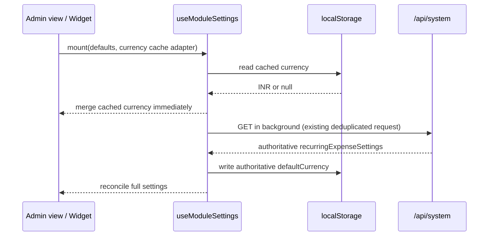
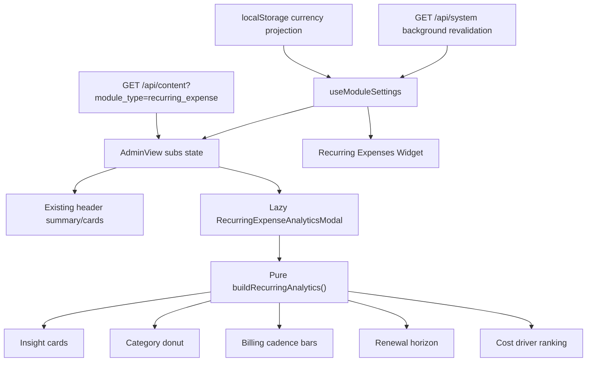

# Recurring Expense Analytics and Currency Cache Design

**Date:** 2026-07-31

**Status:** Decision-complete; ready for implementation handoff

**Primary route:** `/admin/recurring-expenses`

**Scope:** Recurring Expenses admin analytics modal plus persistent browser
caching for the module's default currency

## Overview

Recurring Expenses needs a fast, focused analytics experience without turning
the existing control center into another page or tab. A new Lucide `ChartPie`
button will sit immediately to the left of the existing Settings button in the
header. It opens a responsive modal containing category allocation, billing
cadence, renewal-horizon, and cost-concentration analytics derived from the
records that `AdminView.tsx` has already loaded.

The modal will be code-split and loaded on first use. It will not issue another
API request. All monetary analytics will be scoped to a single record currency
at a time because LifeOS has no exchange-rate source and must not add amounts
from different currencies as if they were equivalent.

The module's default currency will use a versioned, opt-in browser cache. The
cached value is applied immediately after hydration while `/api/system`
revalidates in the background. A newer server value remains authoritative and
replaces the cached value when it arrives. This removes the repeated USD-to-
configured-currency flicker on normal return visits without changing the MongoDB
source of truth.

## Current-State Findings

The relevant current behavior is:

- `src/modules/recurring-expenses/AdminView.tsx:58-134` owns recurring-expense
  constants, settings defaults, record types, and currency symbols locally.
- `src/modules/recurring-expenses/Widget.tsx:14-47` duplicates part of the
  settings type, currency symbols, and defaults.
- `src/hooks/useModuleSettings.ts:10-24` only caches the `/api/system` promise in
  memory for five seconds. Navigation or reload after that window starts from
  the hook defaults and performs another request.
- `src/hooks/useModuleSettings.ts:44-61` initializes settings from defaults and
  applies the server value only after the request resolves. The recurring
  module and widget therefore initially use USD even when the configured
  currency is INR or another currency.
- `src/hooks/useModuleSettings.ts:18-21` currently converts every GET failure
  into an empty configuration, so the hook cannot distinguish a successful
  response with no module settings from a network or HTTP failure.
- `src/modules/recurring-expenses/AdminView.tsx:526` derives the displayed
  currency symbol directly from that asynchronously loaded setting.
- `src/modules/recurring-expenses/AdminView.tsx:993-1015` already derives active
  records, monthly burn, annual burn, and upcoming renewals in memory.
- `src/modules/recurring-expenses/AdminView.tsx:1068-1089` contains the exact
  header action group shown in the supplied screenshot.
- Recharts `3.8.0`, Framer Motion `12.35.0`, and Lucide React are already
  installed. No package change is required.
- Other LifeOS modules already use Recharts and `next/dynamic`, but there is no
  shared, production-complete generic modal with all of the focus behavior this
  feature needs.

## Goals

- Add an analytics icon immediately left of the Recurring Expenses Settings
  icon.
- Open a polished, responsive analytics modal without navigating away from the
  module.
- Show several genuinely different analytical views, including a category
  pie/donut chart.
- Reuse the records already held by `AdminView.tsx`; opening analytics must not
  cause another network request.
- Avoid mathematically invalid aggregation across currencies.
- Lazy-load Recharts and the modal presentation code on first use.
- Apply the cached default currency before normal module/widget content appears
  on repeat visits.
- Revalidate the browser-cached currency against MongoDB-backed system settings
  in the background.
- Keep MongoDB and `/api/system` as the source of truth.
- Provide pure calculation functions and focused tests so a lower-cost
  implementation model can make changes safely.
- Preserve the existing Recurring Expenses CRUD, notification, sorting,
  filtering, drag-and-drop, public view, and widget contracts.

## Non-Goals

- Currency conversion or exchange-rate fetching.
- Combining values from different currencies into one total.
- A new analytics API route or MongoDB aggregation pipeline.
- Persisting computed analytics.
- Exporting analytics to PDF, image, or CSV in this release.
- Custom date-range controls.
- Editing expenses from inside the analytics modal.
- Adding analytics to the public recurring-expenses view.
- Redesigning the existing settings panel or add-expense form.
- Caching all system settings in localStorage.
- Changing the recurring-expense database schema.

## Decision Summary

### Recommended approach

Use a **client-derived, currency-scoped, lazy analytics modal** plus an
**opt-in stale-while-revalidate browser cache adapter** for
`useModuleSettings`.

This is the best fit because the admin page already downloads every recurring
expense, expected record volume is personal-scale, the calculations are small,
and the required charting dependency is already installed.

### Rejected: dedicated analytics API

A server endpoint could pre-aggregate categories and renewal buckets. It would
add another authenticated request, loading/error states, duplicated calculation
contracts, and server tests. It becomes worthwhile only if recurring-expense
volume grows large enough that the admin page stops loading full records.

### Rejected: separate analytics route or tab

A route or top-level tab would support deep links and more space, but the user
explicitly requested an icon-triggered modal. It would also elevate occasional
analysis into the module's primary navigation.

### Rejected: normalize everything into the default currency

There is no exchange-rate provider, rate timestamp, or conversion policy.
Treating USD, INR, EUR, and other records as equal units would produce
misleading charts. The modal will instead expose a currency scope selector when
more than one active currency is present.

### Rejected: cache all recurring-expense settings

Categories, reminder defaults, warning days, number format, and sort behavior
can safely wait for server revalidation and are more likely to change across
devices. Persisting only `defaultCurrency` addresses the reported lag while
keeping browser storage minimal and easy to invalidate.

## User Experience

### Header trigger

The header action order will be:

1. Analytics
2. Settings
3. Add Recurring Expense

The analytics trigger uses the Lucide `ChartPie` icon because the first and
most recognizable view is category allocation. The control uses:

- `aria-label="Open recurring expense analytics"`
- `aria-haspopup="dialog"`
- `aria-expanded={showAnalytics}`
- A minimum `44px × 44px` hit area
- The existing zinc surface at rest
- The accent surface/text treatment while the modal is open
- A visible keyboard focus ring
- A short tooltip on pointer hover/focus

The Settings icon receives an explicit accessible name and the same 44px target
while this action group is being touched. The add button remains the only
primary-colored action.

On narrow screens, the three controls stay in the current wrapping header
action row. The icon buttons must not shrink; the text action may wrap below the
heading if space is insufficient.

### Modal shell

The modal is a full-height sheet on small phones and a centered, large dialog
on larger screens:

- Mobile: `h-[100dvh]`, edge-to-edge, scrollable body, bottom safe-area padding.
- `sm` and above: `max-w-6xl`, `max-h-[92dvh]`, rounded `3xl` surface.
- Scrim: `bg-zinc-950/70` with a restrained backdrop blur.
- Surface: theme-aware `zinc-950`/`zinc-900` layers and semantic borders.
- Header: sticky within the dialog with the chart icon, title, scope metadata,
  optional currency selector, and close button.
- Body: one vertical scroll region. Charts themselves do not create nested
  scroll areas.

The visual direction is a restrained financial-observatory bento layout:
precise typography, tabular figures, thin borders, one subtle accent glow, and
compact explanatory labels. It intentionally avoids unrelated gradients,
decorative glass layers, raw hex colors, and excessive animation.

The dialog title is **Recurring Expense Analytics**. Its description is:
**Active commitments, normalized monthly and scoped by currency.**

### Modal interaction behavior

- Opening stores the currently focused trigger and moves focus to the modal
  close button.
- `Escape`, the explicit close button, or clicking the backdrop closes it.
- `Tab` and `Shift+Tab` remain trapped inside the open dialog.
- Closing restores focus to the analytics trigger.
- Body scrolling is locked while open and restored to its previous value on
  close.
- The modal uses `role="dialog"`, `aria-modal="true"`,
  `aria-labelledby`, and `aria-describedby`.
- Enter motion uses opacity and a small translate/scale over 180-240ms.
- Exit motion is shorter than enter motion.
- `prefers-reduced-motion` disables chart entrance and dialog transforms while
  keeping content immediately readable.

### Currency scope

Analytics uses active records only.

The initial currency is selected as follows:

1. Use `settings.defaultCurrency` if at least one active record has that
   currency.
2. Otherwise use the first active currency sorted by ISO code.
3. If no active records exist, keep `settings.defaultCurrency` for empty-state
   copy and formatting.

If active records contain one currency, show a non-interactive scope badge such
as `INR only`.

If active records contain multiple currencies, show a labeled select in the
modal header. Changing it recomputes the modal locally and performs no network
request.

Display this disclosure whenever multiple currencies exist:

> Values are shown one currency at a time. LifeOS does not apply exchange
> rates.

Inactive records are excluded from every figure. A visible `Active only` badge
makes this rule clear.

## Analytics Content

The modal contains four insight cards followed by four analytical panels.

### Insight cards

#### Committed monthly

The sum of normalized monthly equivalents for active records in the selected
currency.

#### Dominant category

The category with the largest monthly equivalent plus its percentage of
selected-currency monthly burn. If there is no value, show `—`.

#### Largest cost driver

The expense with the largest monthly equivalent and its formatted monthly
amount.

#### Next-renewal pressure

The sum of the raw next charges due from today through the next 30 days,
inclusive, plus the number of affected expenses. Overdue records are reported
separately in supporting text and are not folded into the future-30-day amount.

### Panel 1: Category allocation

Use a donut chart because it answers a proportion question.

- Metric: monthly equivalent.
- Group by: `payload.category`.
- Sort: descending value, then category name for deterministic ties.
- Slices: top five categories plus one combined `Other` slice.
- If a real category is already named `Other`, combine it with the collapsed
  remainder instead of creating two `Other` rows.
- Center label: total selected-currency monthly burn.
- Legend rows: category, formatted amount, percentage.
- Tooltip: category, formatted amount, percentage, and item count.

The chart must never render more than six slices. This keeps labels and touch
targets usable and avoids the common unreadable many-slice pie-chart failure.

### Panel 2: Billing cadence

Use a compact horizontal bar chart to compare monthly impact across cycles.

- Group by: daily, weekly, monthly, quarterly, yearly.
- Primary metric: monthly equivalent.
- Supporting value: active record count.
- Omit zero-value cycles.
- Sort bars by monthly equivalent descending.
- Directly label each bar with the formatted monthly value.

### Panel 3: Renewal horizon

Use five vertical bars for the next scheduled charge of each active record:

- `Overdue`
- `0–7 days`
- `8–30 days`
- `31–90 days`
- `91+ days`

Each bucket carries:

- `count`: number of records.
- `amount`: sum of the raw next charge in the selected currency.

The visible bar encodes count because it is directly comparable across billing
cycles. The tooltip and supporting label show the raw next-charge amount. The
chart title explicitly says **Next renewal horizon**, not forecast, because it
does not synthesize future repeated occurrences.

### Panel 4: Largest cost drivers

Use a ranked horizontal list with progress bars rather than another chart axis.

- Sort active records by monthly equivalent descending.
- Show at most seven records.
- Each row displays rank, name, category, billing cadence, original charge, and
  monthly equivalent.
- The bar width is relative to the largest monthly equivalent in the selected
  currency.
- Long names wrap to two lines rather than being available only by tooltip.

This panel remains readable and keyboard/screen-reader friendly without relying
on Recharts internals.

### Empty states

If there are no active recurring expenses at all:

> No active recurring expenses to analyze.

If active records exist but none match the selected currency:

> No active expenses use {currency}. Choose another currency to view its
> analytics.

Charts are not rendered behind an empty state. The dialog shell, close control,
currency control, and explanatory copy remain available.

### Accessible chart data

Every chart panel includes:

- A short text insight above or below the visual.
- A descriptive `aria-label`/screen-reader summary containing the leading
  value.
- A visible legend or directly labeled rows; color is never the only carrier.
- A collapsed native `<details>` section named **View data table** containing
  the exact label, amount, percentage/count values represented by the chart.
- Tooltip values formatted with the selected currency and configured number
  format.

## Calculation Contract

All derived values live in a pure module. UI components receive already
aggregated data and do not reproduce formulas.

### Monthly equivalent

The implementation must preserve the module's existing behavior:

```ts
function monthlyEquivalent(cost: number, cycle: BillingCycle): number {
  if (cycle === "yearly") return cost / 12;
  if (cycle === "quarterly") return cost / 3;
  if (cycle === "weekly") return cost * 4.33;
  if (cycle === "daily") return cost * 30.44;
  return cost;
}
```

This function moves out of `AdminView.tsx` and becomes the single source used
by cards, sorting, header totals, and modal analytics. Do not change the factors
in the same feature; changing them would create a separate behavioral
regression.

### Proposed result shape

```ts
interface RecurringAnalytics {
  currency: string;
  activeCount: number;
  monthlyBurn: number;
  annualizedBurn: number;
  dominantCategory: {
    name: string;
    value: number;
    share: number;
  } | null;
  largestDriver: {
    id: string;
    name: string;
    monthlyEquivalent: number;
  } | null;
  dueWithin30Days: {
    count: number;
    amount: number;
    overdueCount: number;
  };
  categories: Array<{
    name: string;
    value: number;
    count: number;
    share: number;
  }>;
  billingCycles: Array<{
    cycle: BillingCycle;
    value: number;
    count: number;
  }>;
  renewalHorizon: Array<{
    key: "overdue" | "week" | "month" | "quarter" | "later";
    label: string;
    count: number;
    amount: number;
  }>;
  costDrivers: Array<{
    id: string;
    name: string;
    category: string;
    cycle: BillingCycle;
    originalCost: number;
    monthlyEquivalent: number;
  }>;
}
```

### Date rules

- `now` is passed into the pure builder as an epoch-millisecond number so tests
  are deterministic.
- Day differences use the existing `Math.ceil((renewal - now) / 86_400_000)`
  behavior.
- A renewal with `days === 0` belongs to `0–7 days`.
- `dueWithin30Days` includes `days >= 0 && days <= 30`.
- Invalid renewal timestamps are excluded from renewal buckets and
  next-renewal KPIs, but the record remains in category/cadence/cost analytics.
- Calculations never mutate or sort the source `expenses` array in place.

### Numeric precision

Aggregate using JavaScript numbers and keep raw precision in the result.
Round only in formatting at the presentation boundary. Use the existing
`formatNumber`/`formatCurrency` helpers and the module's configured western or
Indian number format.

## Browser Currency Cache

### Cache contract

Extend `useModuleSettings` with an optional third argument:

```ts
export interface ModuleSettingsBrowserCache<T extends Record<string, unknown>> {
  read(): Partial<T> | null;
  write(settings: T): void;
}

export function useModuleSettings<T extends Record<string, unknown>>(
  settingsKey: string,
  defaults: T,
  browserCache?: ModuleSettingsBrowserCache<T>,
): {
  settings: T;
  updateSettings(updates: Partial<T>): Promise<void>;
  saving: boolean;
  loaded: boolean;
};
```

Existing callers omit the third argument and retain current behavior.

The recurring-expense adapter uses:

```text
lifeos:recurring-expenses:default-currency:v1
```

Its stored JSON payload is:

```json
{
  "defaultCurrency": "INR"
}
```

Only the three-letter uppercase ISO code is stored. Categories, notification
preferences, sort order, and other settings are not written to browser storage.

### Read/revalidate sequence



Rules:

- Initial React state remains `defaults` so server rendering and hydration are
  deterministic.
- Browser storage is read only inside an effect.
- The synchronous cache read and state update happen before waiting for the
  network promise.
- The `/api/system` request still runs in the background.
- A valid server value replaces a stale cached value and refreshes the cache.
- A successful server response with no recurring-expense settings makes
  defaults authoritative and overwrites/removes a stale cached value.
- A network failure, non-OK HTTP response, or malformed response retains the
  cached value (or defaults when no cache exists), does not overwrite browser
  storage, and still completes `loaded`.
- A malformed value, unsupported JSON shape, storage quota error, disabled
  storage, or `SecurityError` is ignored. These failures must never prevent
  settings or content from loading.
- `loaded` continues to mean that server revalidation completed, not merely
  that a browser cache was read.

### Update sequence

When `updateSettings({ defaultCurrency })` runs:

1. Merge and update React state optimistically, as today.
2. Write the selected default currency to localStorage immediately.
3. PUT the full merged module settings to `/api/system`.
4. Invalidate the existing five-second in-memory system cache after a
   successful PUT.
5. If the PUT fails, log the failure using the current hook behavior. The next
   mount/revalidation restores the server value and corrects localStorage.

The implementation should check `response.ok` before treating a PUT as
successful. This makes a rejected API response follow the same path as a
network error.

### Shared consumption

Both of these callers use the same exported recurring-expense defaults and
browser-cache adapter:

- `src/modules/recurring-expenses/AdminView.tsx`
- `src/modules/recurring-expenses/Widget.tsx`

This ensures a currency changed in the module is available immediately when the
dashboard widget next mounts, and vice versa.

## Component and Data Flow



The modal owns presentation state such as selected currency and chart
tooltips. `AdminView` owns only whether analytics has ever been requested and
whether it is currently open.

To preserve exit animation without eager-loading the chunk:

1. `hasRequestedAnalytics` starts `false`.
2. Clicking the trigger sets `hasRequestedAnalytics=true` and
   `showAnalytics=true`.
3. The dynamic component is not rendered, and therefore not requested, before
   the first click.
4. After the first click it remains mounted and receives `isOpen`; closing
   renders its `AnimatePresence` exit state without discarding the loaded
   chunk.

The `next/dynamic` options must be an object literal, per repository
conventions. Its loading function renders an analytics-modal skeleton with a
dialog scrim, header shell, and chart-card shimmer rather than a bare spinner.

## File Plan

| File                                                                                          | Action | Responsibility                                                                                                                                                                                                                              |
| --------------------------------------------------------------------------------------------- | ------ | ------------------------------------------------------------------------------------------------------------------------------------------------------------------------------------------------------------------------------------------- |
| `src/hooks/useModuleSettings.ts`                                                              | Modify | Add the optional browser-cache adapter, cache-first/background-revalidate flow, safe adapter failures, distinguish successful absence from request failure, and add `response.ok` handling while preserving current callers.                |
| `src/hooks/__tests__/useModuleSettings.test.tsx`                                              | Modify | Cover pre-network cache hydration, server reconciliation, cache writes on update, missing server settings, adapter exceptions, and unchanged no-adapter behavior.                                                                           |
| `src/modules/recurring-expenses/types.ts`                                                     | Create | Own `BillingCycle`, `RecurringExpense`, `RecurringExpenseSettings`, and recurring sort-mode types shared by admin, widget, analytics, and cache code.                                                                                       |
| `src/modules/recurring-expenses/config.ts`                                                    | Create | Own billing cycles, default categories, supported currency display options, symbol lookup, and the full typed module defaults.                                                                                                              |
| `src/modules/recurring-expenses/settings-cache.ts`                                            | Create | Implement the versioned localStorage adapter that reads/writes only `defaultCurrency` and validates a three-letter uppercase code.                                                                                                          |
| `src/modules/recurring-expenses/__tests__/settings-cache.test.ts`                             | Create | Verify valid reads/writes, malformed JSON, wrong shapes, invalid codes, and storage exceptions.                                                                                                                                             |
| `src/modules/recurring-expenses/analytics.ts`                                                 | Create | Own `monthlyEquivalent`, currency discovery/selection, deterministic category collapsing, cadence aggregation, renewal buckets, cost-driver ranking, and the complete pure analytics result.                                                |
| `src/modules/recurring-expenses/__tests__/analytics.test.ts`                                  | Create | Unit-test formulas, inactive exclusion, mixed-currency isolation, top-five-plus-Other grouping, date boundaries, invalid dates, deterministic ties, and immutability.                                                                       |
| `src/modules/recurring-expenses/components/AnalyticsModalSkeleton.tsx`                        | Create | Provide an immediate fixed-dialog skeleton while the first-use modal chunk loads.                                                                                                                                                           |
| `src/modules/recurring-expenses/components/RecurringExpenseAnalyticsModal.tsx`                | Create | Implement portal/dialog behavior, focus management, currency scope, insight cards, Recharts panels, cost-driver list, data tables, responsive layout, empty states, and reduced motion.                                                     |
| `src/modules/recurring-expenses/components/__tests__/RecurringExpenseAnalyticsModal.test.tsx` | Create | Verify dialog semantics, default/fallback currency choice, multi-currency disclosure, empty states, data labels/tables, Escape/backdrop close, focus trap, and focus restoration.                                                           |
| `src/modules/recurring-expenses/AdminView.tsx`                                                | Modify | Use shared types/config/analytics helper, add lazy modal state/import, insert the analytics button left of Settings, pass existing records/settings, improve action labels/targets, and remove duplicated constants/local number formatter. |
| `src/modules/recurring-expenses/__tests__/AdminView.test.tsx`                                 | Modify | Verify header action order and labels, first-click modal loading/open behavior, and that opening analytics does not add a content/API fetch.                                                                                                |
| `src/modules/recurring-expenses/Widget.tsx`                                                   | Modify | Use shared settings defaults, symbols, types, and currency-cache adapter so the widget receives the same immediate cached currency.                                                                                                         |
| `src/modules/recurring-expenses/README.md`                                                    | Modify | Document analytics definitions, active/currency scoping, no-FX behavior, and the default-currency cache/revalidation contract.                                                                                                              |

No route, schema, seed, registry, package manifest, middleware, or MongoDB
collection file changes are required.

## Implementation Phases

### Phase 1: Extract contracts and pure analytics

1. Add the shared recurring-expense types and configuration constants.
2. Move `monthlyEquivalent` to the pure analytics module without changing its
   factors.
3. Update existing AdminView/Widget imports sufficiently to use the shared
   contracts.
4. Write the pure analytics tests before implementing aggregations.
5. Implement currency selection, category collapse, cadence aggregation,
   renewal buckets, and cost-driver ranking.
6. Run the focused analytics/config tests.

This phase is independently reviewable and must not change visible behavior.

### Phase 2: Add opt-in browser caching

1. Add adapter tests to `useModuleSettings`.
2. Extend the hook signature without changing the behavior of existing
   two-argument callers.
3. Implement the versioned recurring-currency localStorage adapter and its
   tests.
4. Pass the adapter from AdminView and Widget.
5. Verify cache-first display using a deferred `/api/system` test response.
6. Verify a different server value replaces the cache after revalidation.

This phase produces the minor currency performance improvement even before the
analytics UI is added.

### Phase 3: Build the modal

1. Write modal interaction and empty-state tests.
2. Implement the portal, focus trap, scroll lock, close behavior, and responsive
   shell.
3. Add the four insight cards.
4. Add category allocation and its data table.
5. Add billing cadence and renewal horizon.
6. Add the ranked cost-driver panel.
7. Apply semantic chart colors, accessible legends/tooltips, and reduced-motion
   behavior.
8. Implement the fixed modal skeleton.
9. Run focused modal tests.

### Phase 4: Wire first-use loading and header actions

1. Add `hasRequestedAnalytics` and `showAnalytics` state to AdminView.
2. Add the object-literal `next/dynamic` import for the modal.
3. Insert the analytics control immediately before Settings.
4. Add accessible labels, focus rings, and 44px targets to both icon controls.
5. Pass the existing `subs`, `settings.defaultCurrency`,
   `settings.numberFormat`, and stable `now` value into the modal.
6. Update AdminView tests and verify no extra fetch happens on open.

### Phase 5: Documentation and verification

1. Update the recurring-expenses README.
2. Run `pnpm format`.
3. Run focused tests for the hook, analytics builder, modal, AdminView, and
   Widget.
4. Run `pnpm check`.
5. Start `pnpm dev` and use Playwright to verify:
   - Desktop at approximately `1440 × 1000`.
   - Mobile at approximately `375 × 812`.
   - Light and dark theme mappings.
   - One-currency, mixed-currency, and no-active-data states.
   - Keyboard open, tab cycle, Escape close, and focus restoration.
   - No console errors or chart overflow.
   - Cached currency appears before delayed server revalidation.
   - A changed server currency reconciles without a reload.

## Test Matrix

### Pure analytics

- Monthly, yearly, quarterly, weekly, and daily normalization matches current
  production factors.
- Inactive records do not affect any output.
- Selecting INR excludes USD/EUR records from all monetary and count analytics.
- The default currency wins when it exists among active records.
- The first sorted active currency is used when the default does not exist.
- Category values and percentages sum to the selected-currency monthly burn.
- More than five categories collapse deterministically into one `Other` slice.
- Existing `Other` and collapsed categories become one slice.
- Cost-driver ties have deterministic name/ID ordering.
- Renewal boundaries classify `-1`, `0`, `7`, `8`, `30`, `31`, `90`, and `91`
  correctly.
- Invalid dates do not poison numeric results.
- The input array and payload objects remain unchanged.

### Browser cache

- No adapter preserves current hook behavior.
- A cached INR value is visible while the GET promise is still pending.
- Server EUR replaces cached INR and writes EUR back to the adapter.
- Missing server settings restore defaults rather than retaining stale cache.
- A failed GET retains cached INR and does not write defaults over it.
- `updateSettings({ defaultCurrency: "GBP" })` writes GBP immediately.
- Cache read/write exceptions do not reject the hook or block `loaded`.
- Non-OK GET and PUT responses follow their failure paths.
- Corrupt localStorage JSON and lowercase/long currency codes are ignored.

### Modal and integration

- The analytics button precedes Settings in DOM and visual order.
- Icon-only actions have accessible names and minimum target classes.
- First click renders an immediate modal skeleton, then a named dialog.
- Opening analytics does not trigger `/api/content` or `/api/system`.
- Closing by button, backdrop, and Escape all invoke `onClose`.
- Focus is trapped while open and restored on close.
- One currency shows a scope badge; multiple currencies show a labeled select
  and no-FX disclosure.
- Changing the modal currency changes all displayed analytics locally.
- Empty states do not render empty chart canvases.
- Data-table values match chart/legend values.
- Modal content fits 375px without horizontal page scroll.

## Performance Budget

- No new request when analytics opens.
- Recharts and modal code are absent from the initial recurring-expense module
  chunk and requested only on first analytics use.
- Analytics construction remains `O(n log n)` because of small sorted result
  sets; all grouping passes are `O(n)`.
- Use one `useMemo` per selected currency/result build rather than separate
  full-array scans in each chart component.
- The pure builder returns at most six category rows, five cadence rows, five
  renewal rows, and seven cost-driver rows to Recharts/presentation.
- Do not animate layout dimensions; use opacity/transform only.
- No new dependency is added.

## Error and Resilience Behavior

- Analytics cannot have a network error because it consumes already-loaded
  records.
- A localStorage failure degrades to current server-backed settings behavior.
- A malformed cached currency is ignored and replaced after server
  revalidation.
- A failed server revalidation retains a valid cached currency instead of
  interpreting the failure as missing settings.
- A chart with no usable rows renders a designed empty state.
- Invalid record dates affect only date-based analytics.
- Unknown but valid three-letter currency codes render using the code itself
  when no symbol is available.
- If the lazy chunk is still loading, the skeleton provides immediate feedback
  with `role="status"` and `aria-label="Loading recurring expense analytics"`.
- No exception path may leave `document.body.style.overflow` locked.

## Security and Privacy

- The browser cache contains only a non-sensitive ISO currency code.
- No recurring-expense names, costs, categories, URLs, notes, or notification
  preferences are stored in localStorage.
- The modal renders text through React and does not use raw HTML.
- No external chart, analytics, or exchange-rate service receives data.
- Existing middleware/API authorization remains unchanged.

## Rollout and Rollback

No data migration or feature flag is required.

The change is backward compatible:

- Existing recurring-expense documents are read without modification.
- Existing system settings remain in MongoDB under
  `recurringExpenseSettings`.
- Existing `useModuleSettings` callers retain the two-argument behavior.
- Older application versions ignore the browser key.

Rollback consists of removing the modal trigger/import and stopping use of the
optional cache adapter. The versioned localStorage key can remain harmlessly or
be removed by the adapter cleanup; no server cleanup is required.

## Acceptance Criteria

- [ ] A `ChartPie` icon appears immediately left of the Settings icon.
- [ ] The icon opens a responsive, named analytics dialog and never navigates.
- [ ] The modal includes category allocation, billing cadence, renewal horizon,
      cost drivers, and four insight cards.
- [ ] All monetary analytics include active records from exactly one currency.
- [ ] Mixed-currency data exposes a selector and a no-conversion disclosure.
- [ ] Category allocation shows no more than six slices.
- [ ] Opening analytics performs no new API request.
- [ ] The analytics/Recharts chunk is requested only after first use.
- [ ] The modal supports keyboard focus trapping, Escape, backdrop close, focus
      restoration, reduced motion, and 375px layouts.
- [ ] Every chart has labels, exact tooltip values, a screen-reader summary, and
      a native data-table alternative.
- [ ] The recurring module and dashboard widget use the same cached default
      currency immediately on repeat visits.
- [ ] `/api/system` revalidates in the background and corrects stale cache.
- [ ] Storage errors and malformed cache values degrade safely.
- [ ] No database, API, schema, registry, middleware, or dependency change is
      introduced.
- [ ] Focused tests and `pnpm check` pass.
- [ ] Playwright desktop/mobile and light/dark visual checks show no overflow,
      console errors, or broken interactions.

## What Is Not Changing

- Existing header Monthly Burn, Annualized Burn, and Active Expenses card
  placement.
- Existing recurring-expense CRUD payloads.
- Existing per-record currency data.
- Existing settings fields and MongoDB location.
- Existing renewal notification behavior.
- Existing sort, filter, search, and drag-and-drop behavior.
- Existing widget summary endpoint.
- Existing public view.

## Handoff Notes

Implementation should begin with pure functions and cache tests, not the chart
markup. The critical correctness rule is that records with different currency
codes are never summed together. The critical performance rule is that the
modal receives `subs` from AdminView and does not fetch. The critical cache rule
is that localStorage improves first paint but never replaces background
revalidation against `/api/system`.

There are no unresolved product questions in this specification. The user
explicitly delegated engineering decisions and requested an implementation-
ready design without a clarification round.
