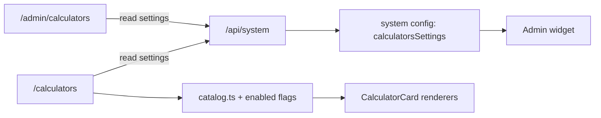

# Calculators Module

## Overview

The **Calculators** module provides a configurable catalog of finance and utility calculators for the public site. Admin users control which categories and calculator tools are visible; all pages render from that visibility config.

The calculator catalog itself is defined in `src/modules/calculators/catalog.ts` and is **static code data**. User-facing visibility is stored as module settings under the global system config key `calculatorsSettings`.

## Registration

- **Module slug**: `calculators`
- **Registry name**: `Calculators`
- **Icon**: `Calculator`
- **Default visibility**: `false`
- **Primary content type**: `calculator_profile`
- **Admin route**: `/admin/calculators`
- **Public route**: `/calculators`
- **Dashboard widget**: `/admin` tile via `src/modules/calculators/Widget.tsx`

## Data Contracts

### Settings Storage (`/api/system`)

`useModuleSettings` persists module settings in `SystemConfig` under key `calculatorsSettings`.

- **Route (read/write)**: `/api/system` (admin-protected)
- **Schema intent**: `CalculatorProfileSchema` in `src/lib/schemas.ts`

| Field | Type | Notes |
| --- | --- | --- |
| `enabledCategories` | `Record<string, boolean>` | Optional map of calculator category IDs (`core`, `debt`, `tax`, `returns`, `conversion`, `utilities`) to visibility flags. |
| `enabledCalculators` | `Record<string, boolean>` | Optional map of individual calculator IDs to visibility flags (e.g., `sip`, `emi`, `cagr`, etc.). |
| Additional keys | `unknown()` | Additional keys are currently tolerated for forward compatibility. |

### Static Catalog (Non-persistent)

The calculator tool definitions are static in `src/modules/calculators/catalog.ts` and include:

- `CALCULATOR_CATEGORIES`: six category groups.
- `CALCULATOR_DEFINITIONS`: 34 calculator definitions.
- `CalculatorDefinition` and `CalculatorInputDefinition` types in `src/modules/calculators/types.ts`.

## Features

- **Admin controls**:
  - Load/sync persisted visibility settings from system config.
  - Toggle each category and each calculator independently.
  - One-click enable/disable controls per section.
  - Summary counters for total calculators, enabled calculators, and enabled categories.
- **Widget behavior**:
  - Dashboard card reads the same settings via `useModuleSettings`.
  - Shows enabled calculator count and mini-stats by category (Investing, Debt, Tax).
  - Deep-link target is `/admin/calculators`.
- **Public behavior**:
  - Search and category filtering over all enabled calculators.
  - Expandable calculator card that computes and renders results client-side.
  - Results expose primary value, optional secondary value, and a concise breakdown.
  - URL is `/calculators`, no extra query parameters required for baseline navigation.

## Data Flow



## API Notes

```http
GET /api/system
PUT /api/system
Content-Type: application/json
```

Payload for `PUT` updates only module settings keys ending in `Settings`.

Example body to force-enable all calculators and categories:

```json
{
  "calculatorsSettings": {
    "enabledCategories": {
      "core": true,
      "debt": true,
      "tax": true,
      "returns": true,
      "conversion": true,
      "utilities": true
    },
    "enabledCalculators": {
      "sip": true,
      "emi": true,
      "cagr": true
    }
  }
}
```

## Core Files

- `src/modules/calculators/AdminView.tsx` — admin configuration UI.
- `src/modules/calculators/Widget.tsx` — dashboard widget and loading path.
- `src/modules/calculators/PublicView.tsx` — searchable public catalog and calculators.
- `src/modules/calculators/catalog.ts` — canonical calculator catalog and formulas.
- `src/modules/calculators/types.ts` — category, input, and result type contracts.
- `src/modules/calculators/info.md` — short user-oriented feature notes.
