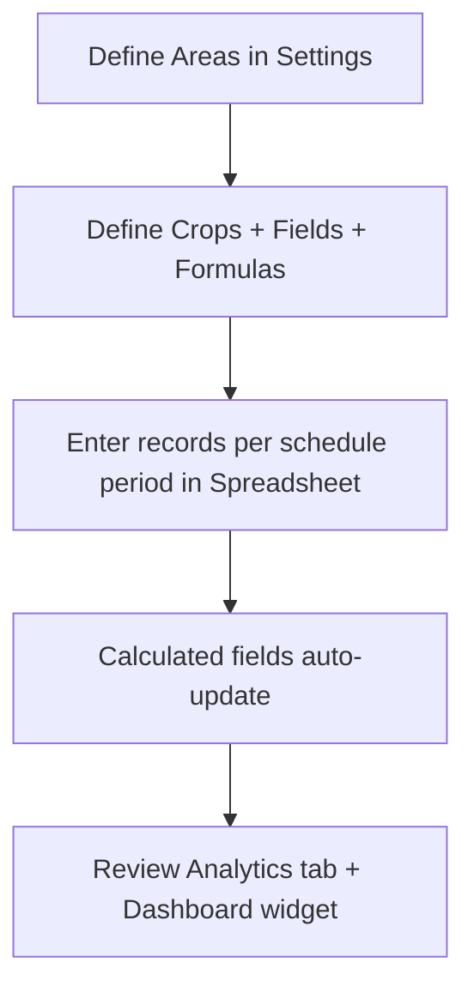

# Crop History

Track farm crop cycles, yield inputs, and seasonal performance with per-area data entry and formula-driven analytics.

## Overview

The Crop History module stores periodic crop records in the polymorphic `content` collection using `module_type: "crop_history"`.

- Admin entry point: `/admin/crop-history`
- Dashboard summary: widget at `/admin` via `src/modules/crop-history/Widget.tsx`
- Configuration state: persisted in system config key `cropHistorySettings`
- Public view: not exposed (no `PublicView.tsx`)

## Data Schema (Current Contract)

### Content record (`content` collection)

| Field         | Type             | Notes                                            |
| ------------- | ---------------- | ------------------------------------------------ |
| `_id`         | `string`         | Content document id                              |
| `module_type` | `"crop_history"` | Discriminator value                              |
| `payload`     | `object`         | Record payload, validated by `CropHistorySchema` |
| `is_public`   | `boolean`        | Not currently surfaced in UI                     |

### `payload`

```json
{
  "crop_id": "coffee",
  "schedule_period": "2026-H1",
  "source_data": {
    "area-west": {
      "undried": 1200,
      "ot": 82
    }
  },
  "summary_data": {
    "avg_price": 4200
  },
  "notes": "Weather was dry this period."
}
```

- `crop_id`: required reference to a configured crop in `cropHistorySettings.crops`
- `schedule_period`: period string used for timeline ordering and trend comparison
- `source_data`: nested map `{ [areaId]: { [fieldId]: number } }`
- `summary_data`: per-period scalar map `{ [fieldId]: number }`
- `notes`: optional free-form notes stored with a record
- `source_data` and `summary_data` default to `{}` and accept numeric strings via Zod coercion.
- `source_data` and `summary_data` are numeric payload maps in the current UI and API contract. Field configuration can still label fields as `text`, but the spreadsheet renders numeric inputs and the schema coerces stored values to numbers; use `notes` for free-form period context.

Validation rules in `CropHistorySchema` (`src/lib/schemas.ts`):

- `crop_id` and `schedule_period` are required.
- `source_data` maps area ids -> field ids -> numeric values.
- `summary_data` maps field ids -> numeric values.
- All numeric fields are normalized through `z.coerce.number()`.
- `notes` is trimmed and capped at 2,000 characters.

### Crop configuration (system config)

Configured under `cropHistorySettings` with these structures:

- `crops: CropConfig[]`
  - `id`, `name`, `scheduleType`
  - `sourceFields`: per-area fields (number/text), each with optional `unit`
  - `summaryFields`: period-level fields
  - `calculatedFields`: formulas and output formats
  - `constants`: optional named numeric constants
  - `analyticsConfig`: optional field ids for trend calculation
  - `periodOrder`: optional custom ordering override
- `sources: AreaDef[]`
  - `id`, `name`

## Module Features

- Tabs:
  - **Spreadsheet**: enter/edit period rows, save all at once, per-area matrix entry
  - **Analytics**: generated trend and aggregate views derived from formula engine
  - **Settings**: define crops, areas, fields, formulas, and constants
  - **Docs**: in-app reference for operators and formulas
- Built-in formula engine for calculated fields and derived metrics
- Revenue/trend summary surfaced in admin widget via `/api/widgets/summary?module_type=crop_history`
- Notes support for period context (weather, pests, observations)

## Formula Engine (Smart Capabilities)

- Aggregates: `SUM(field)`, `AVG(field)`, `WEIGHTED_AVG(value, weight)`, `MIN(field)`, `MAX(field)`, `COUNT()`
- Variables: per-area totals (`total_<field>`), summary fields, previous calculated fields
- Constants: constant references by upper snake case names (e.g., `BAG_SIZE`)
- Operators: `+ - * /`, parentheses, unary `+/-`, and `ROUND(expr, decimals)`
- Safe evaluator with division-by-zero and malformed-expression guards

## Example workflow



## API usage examples

- Fetch crop records
  - `GET /api/content?module_type=crop_history`
- Fetch dashboard summary only
  - `GET /api/widgets/summary?module_type=crop_history`
- Create a new period record
  - `POST /api/content` with `module_type: "crop_history"` and `is_public: false`
- Update an existing period record
  - `PUT /api/content/:id` with a replacement `payload`
- Delete an existing period record
  - `DELETE /api/content/:id`

### Create/update a record (conceptual)

```bash
curl -X POST /api/content \
  -H "Content-Type: application/json" \
  -d '{
    "module_type": "crop_history",
    "payload": {
      "crop_id": "coffee",
      "schedule_period": "2026-H2",
      "source_data": {
        "area-west": {
          "undried": 1200
        }
      },
      "summary_data": {
        "avg_price": 4200
      }
    }
  }'
```

### Update module settings (conceptual)

```bash
curl -X PUT /api/system \
  -H "Content-Type: application/json" \
  -d '{
    "cropHistorySettings": {
      "crops": [
        {
          "id": "coffee",
          "name": "Arabica Coffee",
          "scheduleType": "quarterly",
          "sourceFields": [
            { "id": "undried", "name": "Undried Weight", "type": "number", "unit": "kg" }
          ],
          "summaryFields": [
            { "id": "avg_price", "name": "Avg Price", "type": "number" }
          ],
          "calculatedFields": [
            { "id": "revenue", "name": "Revenue", "formula": "SUM(undried) * avg_price", "format": "currency" }
          ],
          "analyticsConfig": {
            "revenueFieldId": "revenue"
          }
        }
      ],
      "sources": [
        { "id": "area-west", "name": "North Field" }
      ]
    }
  }'
```

## Related files

- `src/modules/crop-history/AdminView.tsx`
- `src/modules/crop-history/Widget.tsx`
- `src/modules/crop-history/AnalyticsTab.tsx`
- `src/modules/crop-history/SpreadsheetTab.tsx`
- `src/modules/crop-history/SettingsTab.tsx`
- `src/modules/crop-history/FormulaEngine.ts`
- `src/modules/crop-history/insights.ts`
- `src/modules/crop-history/info.md`
- `src/lib/schemas.ts` (registration for `crop_history` schema)
- `src/registry.ts` (module registration)
