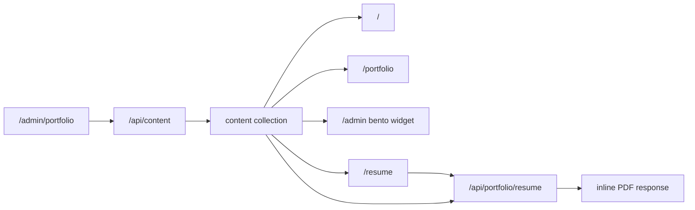

# Portfolio Module

## Overview

The portfolio module powers the public landing page for LifeOS. It stores one
profile document in the shared `content` collection, renders the public
portfolio at `/`, exposes the same public view through `/portfolio`, and links
active resume uploads through the `/resume` viewer.

The admin view at `/admin/portfolio` lets the owner edit identity copy, skills,
social links, hiring availability, and uploaded PDF resumes. The dashboard
widget summarizes the profile with a skills count and hero-title highlight.

## Registration

| Item                 | Value               |
| -------------------- | ------------------- |
| Module slug          | `portfolio`         |
| Registry name        | `Portfolio`         |
| Icon                 | `User`              |
| Public by default    | `true`              |
| Primary content type | `portfolio_profile` |
| Resume content type  | `portfolio_resume`  |

`src/registry.ts` maps the module slug to `portfolio_profile`. Resume uploads
use the same polymorphic data layer with the separate `portfolio_resume`
discriminator.

## Data Schema

Profile payloads are validated by `PortfolioProfileSchema` in
`src/lib/schemas.ts`.

| Field                | Type                  | Notes                                                         |
| -------------------- | --------------------- | ------------------------------------------------------------- |
| `full_name`          | `string`              | Required, trimmed, defaults to `Life OS`, max 100 characters. |
| `hero_title`         | `string`              | Required public headline, 3-200 characters.                   |
| `sub_headline`       | `string?`             | Optional supporting copy, max 500 characters.                 |
| `bio`                | `string`              | Trimmed biography text, max 1000 characters.                  |
| `skills`             | `string[]`            | Skill labels, each trimmed and limited to 50 characters.      |
| `social_links`       | `{ platform, url }[]` | Platform name plus a valid URL.                               |
| `available_for_hire` | `boolean`             | Drives hiring status badges and widget variant.               |

Resume payloads are validated by `ResumeSchema`.

| Field         | Type      | Notes                                      |
| ------------- | --------- | ------------------------------------------ |
| `filename`    | `string`  | Original uploaded PDF filename.            |
| `content`     | `string`  | Base64 data URL for the PDF content.       |
| `is_active`   | `boolean` | Only the active resume is served publicly. |
| `uploaded_at` | `string`  | ISO datetime, defaulted on create.         |

## Features

- Profile editor with dirty-state tracking, reset, save, and status feedback.
- Readiness scoring based on core profile completeness: name, hero title,
  sub-headline, bio length, skill count, and valid social links.
- Suggested skill and social-platform shortcuts for faster profile setup.
- Resume manager for uploading PDFs up to 5MB, activating one resume, and
  deleting old files.
- Public `PortfolioShowcase` with animated hero, social links, skills grid,
  biography section, hiring badge, and optional resume link.
- `/resume` viewer that embeds the active PDF resume served by
  `/api/portfolio/resume` with a profile-derived filename when available.
- Dashboard widget that follows the widget contract with one hero metric
  (`skills.length`) and one highlight row (`hero_title` and `sub_headline`).

## Data Flow



## API Examples

Create the public profile:

```bash
curl -X POST /api/content \
  -H "Content-Type: application/json" \
  -d '{
    "module_type": "portfolio_profile",
    "is_public": true,
    "payload": {
      "full_name": "Life OS",
      "hero_title": "Builder of focused digital systems",
      "sub_headline": "I design and ship practical tools for personal operations.",
      "bio": "A concise background paragraph for the public portfolio.",
      "skills": ["TypeScript", "Next.js", "Product Strategy", "UX Engineering"],
      "social_links": [
        { "platform": "GitHub", "url": "https://github.com/example" },
        { "platform": "Website", "url": "https://example.com" }
      ],
      "available_for_hire": true
    }
  }'
```

Fetch the active resume PDF:

```bash
curl -L /api/portfolio/resume --output resume.pdf
```

## Implementation Notes

- `AdminView.tsx` owns profile editing and resume management.
- `View.tsx` fetches the public profile and active resume for the root
  portfolio page; when a resume exists, `PortfolioShowcase` links to `/resume`.
- `PublicView.tsx` normalizes generic public module items before rendering
  `PortfolioShowcase`.
- `PortfolioShowcase.tsx` is the shared public renderer.
- `src/app/resume/page.tsx` hosts the resume viewer, while
  `src/app/api/portfolio/resume/route.ts` streams the active PDF.
- `Widget.tsx` fetches `portfolio_profile` and renders the constrained bento
  tile.
